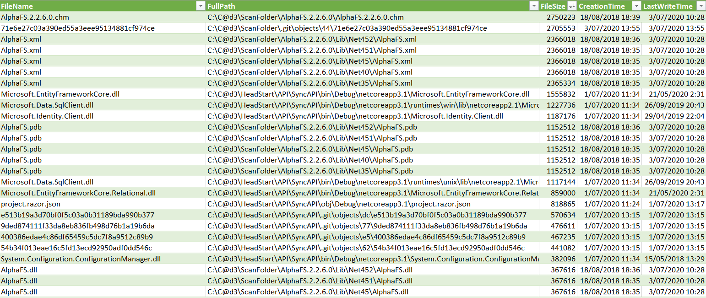

# Folder Scaner (PowerShell)

PowerShell Script to scan the folder (all subfolders and files) and export all the data (name, location, size, created date, modified date) to a .csv file.

The file is ready to run in Window PowerShell ISE
Input: `Folder_Directory`
Output: .csv file
